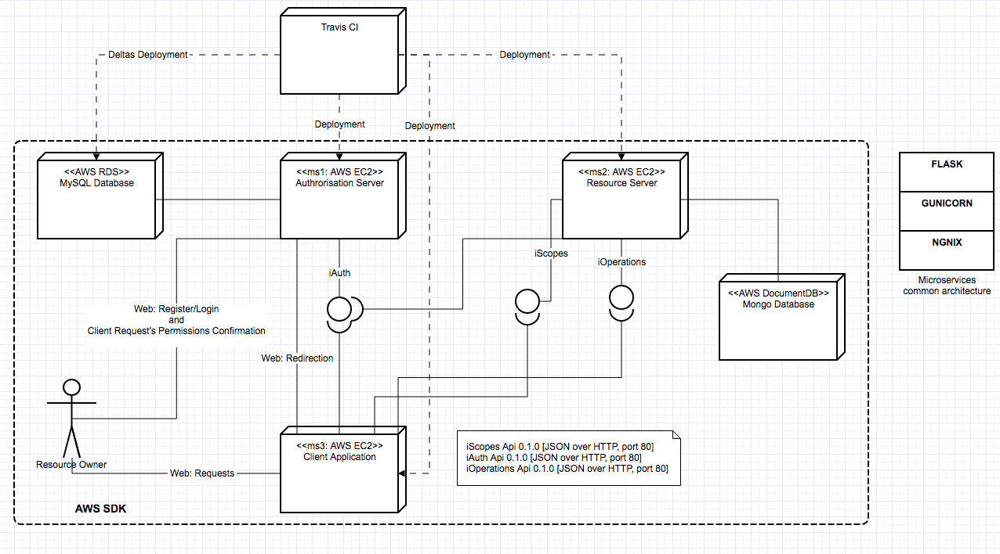

==========================================================
``oAuth2 Protocol Implementation``: Authorisation Server
==========================================================

This is this first of the 3 microservices currently being implemented that will abstract the three main entities
typically interacting in a oAuth2 protocol: **Authorisation Server**, **Resource Server** and **Client Application**.
They all will be deployed using Travis CI and served through **AWS SDK** (EC2, RDS and DocumentDB).

The architecture across the three microservices will be kept the same for maintainability purposes, using Nginx as Web
Server, Gunicorn as WSGI server and Flask/Flask Restplus as Web app and REST API. Additionally the Authorisation Server
and the Resource server are using MySQL and MongoDB online databases, respectively.

All oAuth-related features of the three microservices are implemented following the guidelines as defined by oAuth2.0_.
A architectural diagram showing the services each microservice provide and the relationship between them  is shown
below.

Figure 1: oAuth2 microservices architecture

.. _oAuth2.0:
    https://oauth.net/2/

This underdevelopment instance represents the Authorisation server that both implements the **Authorisation Code**
Grand Type and provides a web and an API interface as follows:

1. Web Interface:
    a.  Resource Owner Login and Registration
    b.  Client Request Confirmation: Resource owners will need to confirm with the Auhtorisation Server that the
        permissions requested by the Resource server are granted.

2. REST API:
    a.  Registration: clients will need to register first with the Authorisation Server
    b.  Verification: clients will need to verify their initial registration after the Authorisation Server's approval
    c.  Authorisation: clients will be granted first with an Authorisation code via an http redirection and then
        a token to be used with the Resource server.

The REST API is being crafted using Open Api -Swagger- for easy end-user documentation, testing and getting-used to.
An example for the *Registration* resource is shown below:

.. image:: docs/images/swagger_sample.png
    :alt: Example of Registration resource
    :target: #