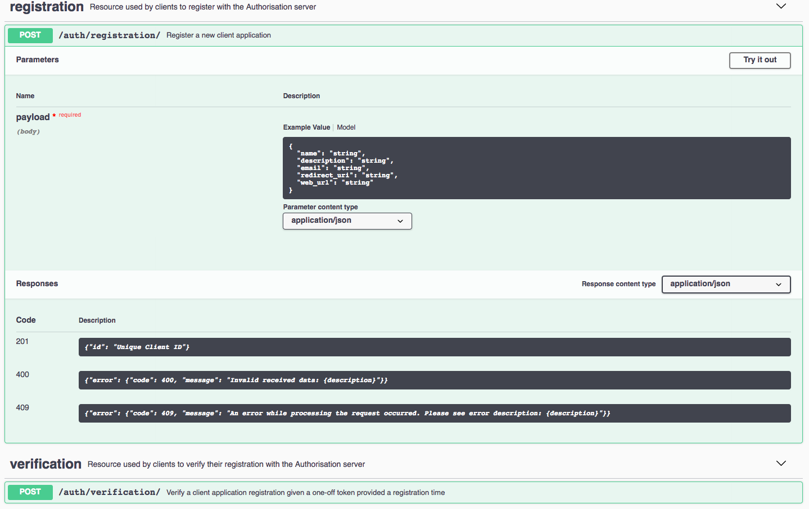

==========================================================
``py_auth_server``: A flask-based authorisation server
==========================================================

.. image:: https://travis-ci.com/d2gex/ms1_auth_server.svg?branch=master
    :target: https://travis-ci.com/d2gex/ms1_auth_server

.. image:: https://img.shields.io/badge/coverage-98%25-brightgreen.svg
    :target: #

**Py_auth_server** is an authorisation server implemented using Flask, Flask Restplus, SqlAlchemy and MySQL following
the _oAuth2.0 protocol guidelines. It also uses JwCrypto for JWK, JWS and JWT of the JOSE Web Standards as specified by
the _IETF. The Authorisation server both implements the **Authorisation Code** Grand Type and provides a web and an API
interface as follows:

1. Web Interface:
    a.  Resource Owner Login and Registration.
    b.  Client Request Confirmation: Resource owners will need to confirm with the Auhtorisation Server that the
        permissions requested by the Client to access the Resource Server are granted.

2. REST API:
    a.  Registration: clients will need to register first with the Authorisation Server.
    b.  Verification: clients will need to verify their initial registration after the Authorisation Server's approval
    c.  Authorisation: clients will be granted first with an Authorisation code via an http redirection and then
        a JWT token to be used with the Resource Server.

.. _oAuth2.0:
    https://www.oauth.com/

.. _IETF:
    https://datatracker.ietf.org/wg/jose/charter/

The REST API has being crafted using Open Api -Swagger- for easy end-user documentation, testing and getting-used to.
An example for the *Registration* resource is shown below:

